# AI Help Desk Ticketing Assistant

A full-stack web application that automates IT support ticket triage using AI. Built from scratch on a Raspberry Pi running Linux, this project covers backend development, database design, API integration, user authentication, and DevOps deployment.

> Built as a portfolio project to demonstrate real-world IT and DevOps skills while working toward a Tier 1 Help Desk role.

---

## What It Does

Users submit IT support tickets through a web form. The moment a ticket is submitted, it is automatically sent to the Claude AI API, which analyzes the issue and returns a triage result — category, priority level, and a suggested fix. Admins log in to a protected dashboard to view all tickets and update their status as they are worked.

---

## Screenshots

### Ticket Submission Form
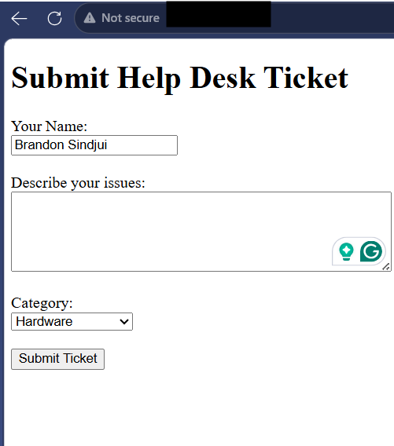

### AI Triage Result
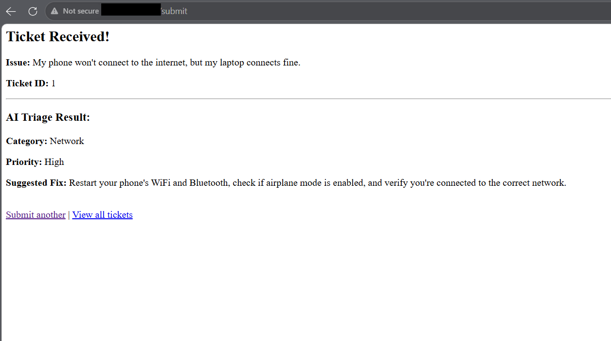

### Admin Login Page
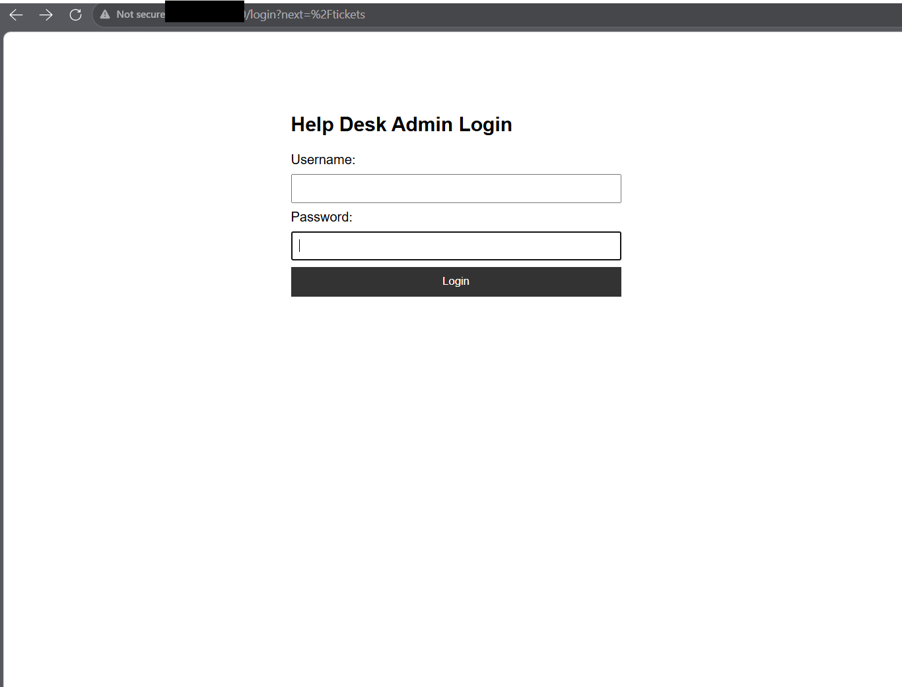

### Admin Dashboard with AI Columns
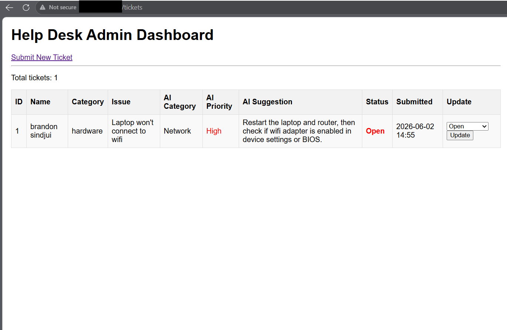

### Ticket Status Updated to Resolved
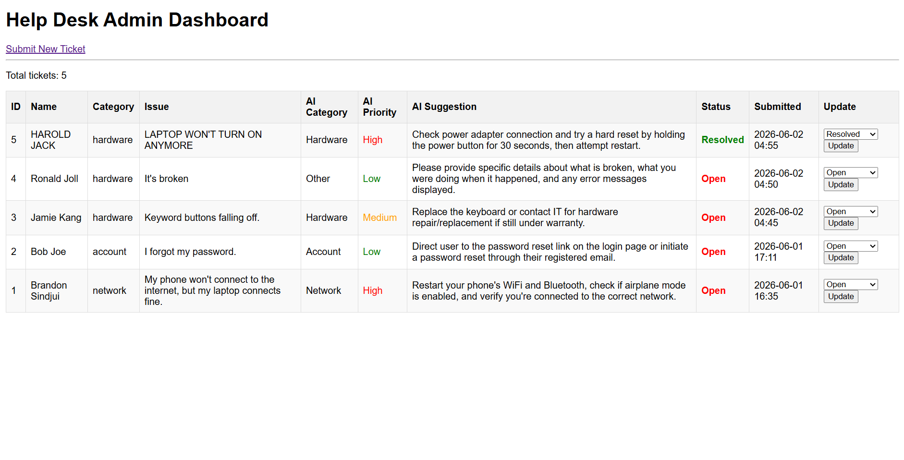

### Database Persistence Proof
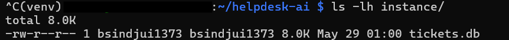

### Docker Container Running
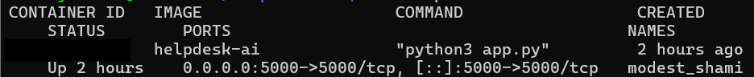

### Project Folder Structure


---

## Tech Stack

| Layer | Technology |
|---|---|
| Language | Python 3 |
| Web Framework | Flask |
| Database | SQLite via Flask-SQLAlchemy |
| AI | Anthropic Claude API (Haiku) |
| Authentication | Flask-Login + Werkzeug password hashing |
| Server | Raspberry Pi OS (Debian/Linux) |
| Deployment | systemd service + Docker |
| Version Control | Git / GitHub |

---

## Features

- Submit IT support tickets with name, issue description, and category
- AI automatically triages every ticket — assigns category, priority (Low/Medium/High), and suggests a fix
- Protected admin dashboard — login required to view or manage tickets
- Update ticket status: Open → In Progress → Resolved
- Tickets persist across restarts via SQLite database
- Runs as a Linux systemd service — starts on boot, restarts on crash
- Fully containerized with Docker
- One-command deployment script

---

## How to Run Locally

**1. Clone the repo:**
```bash
git clone https://github.com/YOUR_USERNAME/helpdesk-ai.git
cd helpdesk-ai
```

**2. Set up virtual environment:**
```bash
python3 -m venv venv
source venv/bin/activate
pip install -r requirements.txt
```

**3. Set your environment variables:**
```bash
export ANTHROPIC_API_KEY="your-api-key-here"
export SECRET_KEY="your-secret-key-here"
```

**4. Run the app:**
```bash
python3 app.py
```

**5. Open your browser:**
```
http://localhost:5000
```

Default admin login: `admin` / `admin123` *(change this in production)*

---

## How to Run with Docker

```bash
docker build -t helpdesk-ai .
docker run -p 5000:5000 \
  -e ANTHROPIC_API_KEY=$ANTHROPIC_API_KEY \
  -e SECRET_KEY=your-secret-key \
  helpdesk-ai
```

---

## Project Structure

```
helpdesk-ai/
├── app.py              # Flask app, routes, database models, AI triage
├── templates/
│   ├── index.html      # Ticket submission form
│   ├── tickets.html    # Admin dashboard
│   └── login.html      # Login page
├── static/             # CSS, JS, images
├── screenshots/        # Project documentation screenshots
├── Dockerfile          # Container definition
├── deploy.sh           # One-command deployment script
├── requirements.txt    # Python dependencies
└── devlogs.md          # Full development log with learning notes
```

---

## What I Built Phase by Phase

### Phase 1 — Foundation
Set up the Raspberry Pi development environment from scratch. Configured Python virtual environments, installed Flask, and built the first working ticket submission form. Learned how HTTP methods work, why virtual environments matter, and how Flask routes connect URLs to Python functions.

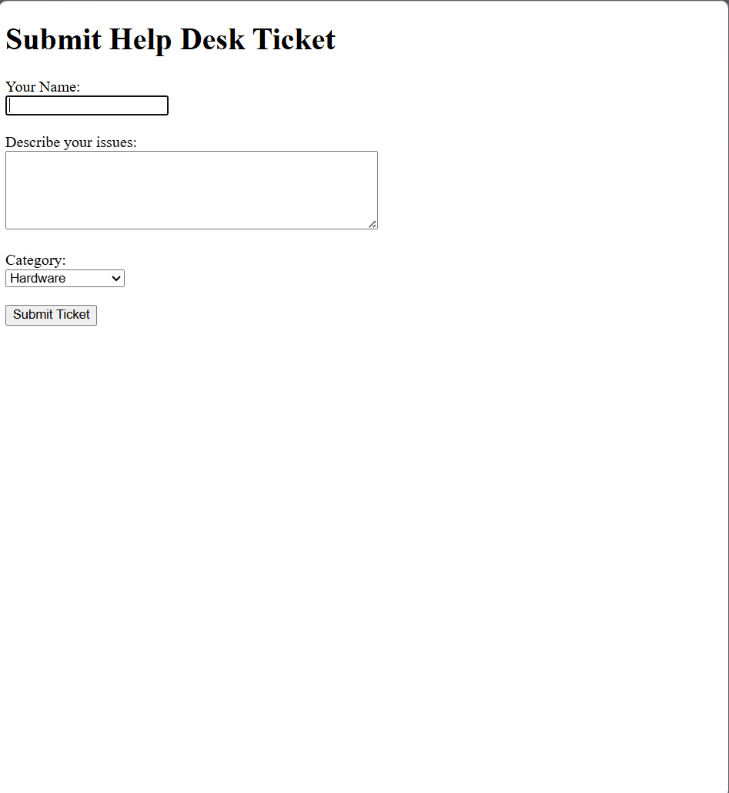
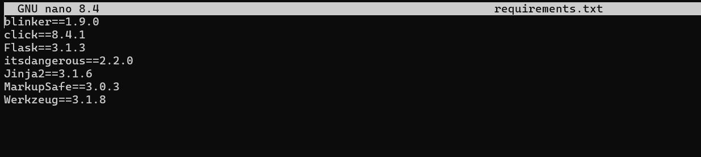

### Phase 2 — Database
Replaced in-memory storage with a persistent SQLite database using SQLAlchemy ORM. Tickets now survive restarts. Built the `/tickets` page to display all records from the database sorted by submission time. Learned the difference between RAM and disk storage, what an ORM is, and why database migrations matter.


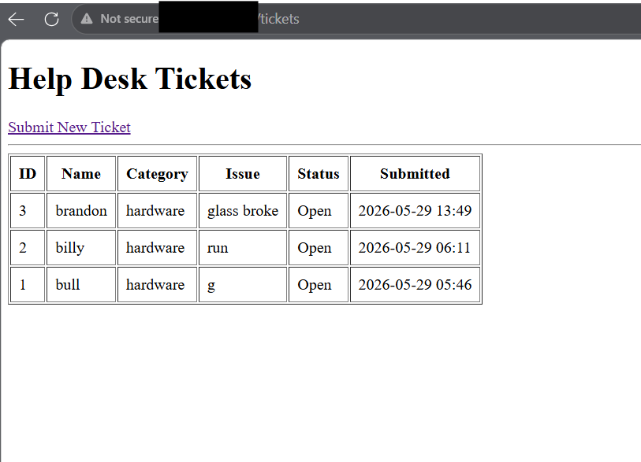

### Phase 3 — AI Integration
Connected the Claude API to automatically triage every incoming ticket. API key stored securely as an environment variable — never hardcoded in source files. Wrote a standalone test script to validate the API before integrating it into the app. Learned prompt engineering, error handling with try/except, and how external API authentication works.

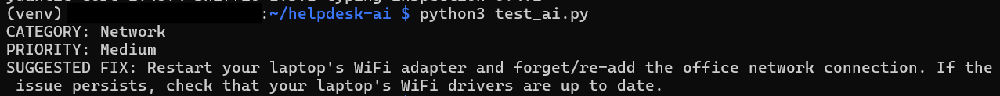


### Phase 4 — Admin Dashboard & Authentication
Built a fully protected admin dashboard with login and logout. Implemented password hashing with Werkzeug so passwords are never stored as plain text. Added CRUD status management so admins can move tickets from Open → In Progress → Resolved. Learned the difference between authentication and authorization, how session cookies work, and why `@login_required` matters.


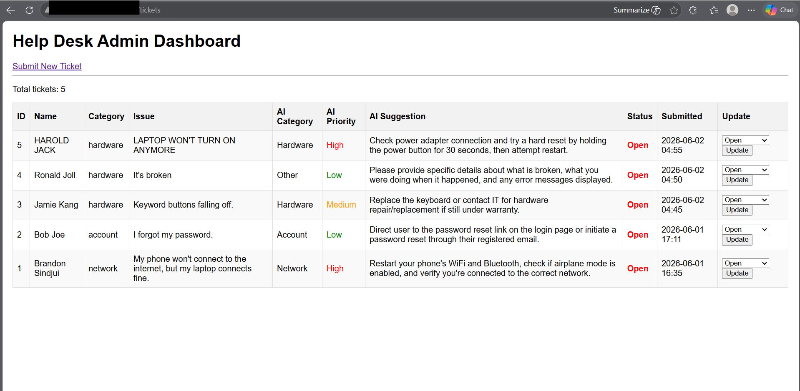


### Phase 5 — DevOps Layer
Deployed the app as a Linux systemd service so it runs on boot and restarts automatically if it crashes. Containerized the app with Docker. Wrote a shell deployment script that stops the service, updates dependencies, restarts, and confirms the app came back up — all in one command. Learned how to read live logs with `journalctl`, how Docker layers and caching work, and how manual deployment scripts relate to CI/CD pipelines.

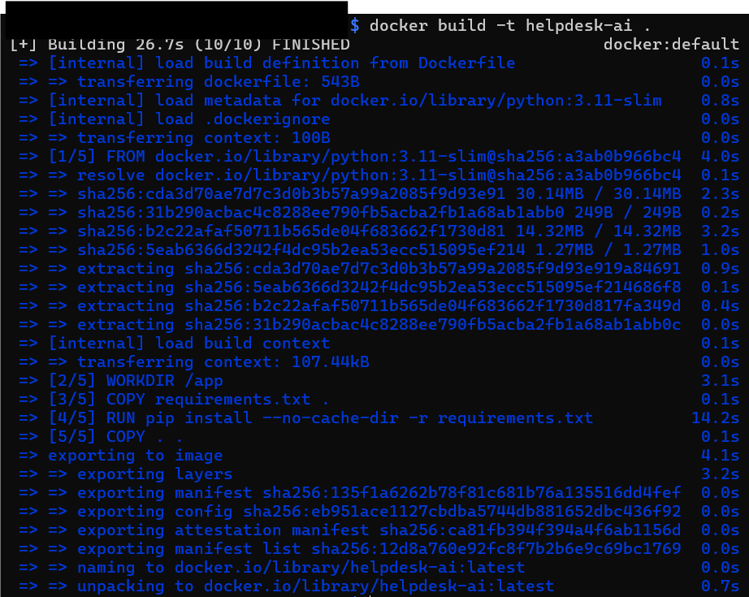


---

## Skills Demonstrated

- Linux system administration on Raspberry Pi OS
- Python web development with Flask
- Database design and ORM usage (SQLAlchemy / SQLite)
- External API integration with secure credential management
- User authentication with hashed passwords (Flask-Login / Werkzeug)
- CRUD operations against a live relational database
- Docker containerization
- systemd service configuration and management
- Shell scripting for deployment automation
- Reading and interpreting server logs (journalctl)
- Git version control with meaningful commit history
- Methodical debugging — reading error messages, isolating components, testing intentionally

---

## Development Log

A full development log is available in [`devlogs.md`](devlogs.md). It documents every phase, every bug encountered, how each was diagnosed and fixed, and concept-check answers covering the theory behind every major decision made in this project.

---

## Author

Built by a self-directed learner working toward a Tier 1 Help Desk role with a long-term goal in DevOps. Every line of this project was written, broken, debugged, and understood — not copied and pasted.
